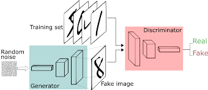

# Generative Adversarial Network
This repository is to demonstrate how we can create new images of a distribution of images with a Generative Adversarial Network (GAN).

## What is GAN ?
> GAN is a architecture which makes use of multiple neural networks that compete against each other to make the predictions.

> ##### Generator:
The network responsible for generating new data from training a data.

> ##### Discriminator:
Identifies and distinguishes a generated image/fake image from an original image of the training combined together form a GAN, both these networks learn based on their previous predictions, competing with each other for the better outcome.

How To Build A GAN In 8 Simple Steps
We will follow the steps given below to build a simple Generative Adversarial Network.

1. Importing the necessary modules
2. Building a simple Generator network
3. Building a simple Discriminator network
4. Building a GAN by stacking the generator and discriminator
5. Plotting the generated images
6. A training method for GAN
7. Loading and processing MNIST data
8. Training The GAN

References & Articles
1. (Intro to GAN)[https://gkadusumilli.github.io/Intro_to_GAN/]
2. (How To Build A Generative Adversarial Network In 8 Simple Steps)[https://analyticsindiamag.com/how-to-build-a-generative-adversarial-network-in-8-simple-steps/]
